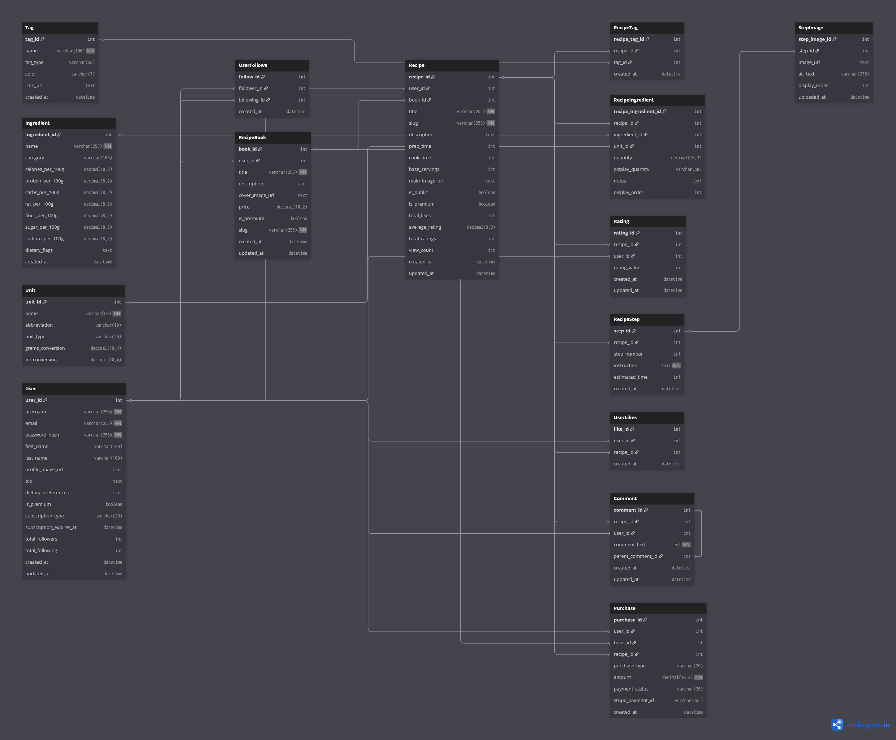
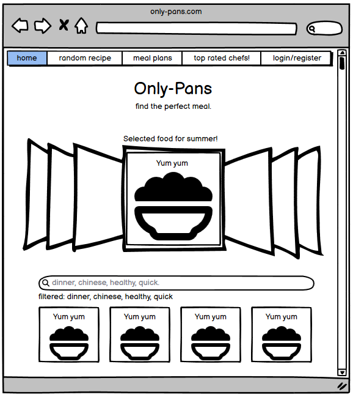
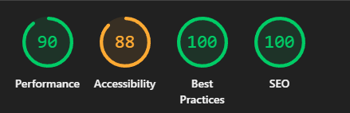

## 🌍 The Idea

OnlyPans is more than just a recipe site—it’s a celebration of good food and the people who make it.  
Whether you're preserving a family tradition, adapting dishes for dietary needs, or just discovering something delicious,  
OnlyPans is here to make sharing easy, joyful, and inclusive.

We believe cooking is for everyone. That’s why we’ve built a platform that’s accessible, welcoming, and full of flavor—from the stories behind the meals to the chefs who bring them to life.

---

### ✨ What Makes OnlyPans Special

-   🌮 **Respectful & Real**  
    We celebrate authentic recipes and welcome creative twists that make them personal.

-   👩‍🍳 **All Skill Levels Welcome**  
    Whether you’re a kitchen newbie or a seasoned chef, your recipes and stories belong here.

-   ♿ **Accessibility First**  
    Screen reader support, keyboard navigation, and clean visual design make it easy to join the fun.

-   📱 **Cook Anywhere**  
    Mobile-first design means you can scroll, stir, and sauté—all at the same time.

### 📊 Database Design (ERD)

-   **Visual Planning**:  
    
-   **Future-Ready**: Designed for growth (subscriptions, messaging, marketplace)
-   **Current Focus**: Clean V1 implementation with room to expand

### 🎨 Wireframes & User Experience

Our wireframes focused on simplicity and accessibility:

#### 🖥️ Desktop Experience



#### 📱 Mobile Experience


## 🛠️ From Dream to Dish: The OnlyPans Journey

### **Original Vision**

### **V1 Reality**

For this first version, I focused on what really matters—helping people create, discover, and talk about great food.

---

Here’s what’s working right now:

-   **Edit & Manage Recipes**: Your personal cookbook, always evolving
-   **Community Features**: Comments, likes, and favorites to spark conversation
-   **Follow Other Cooks**: Build your culinary circle and stay inspired
-   **Accessibility Excellence**: WCAG 2.1 AA compliant, screen reader ready, keyboard friendly
-   **Mobile-Responsive Design**: Cook comfortably from any device

### 🔮 What’s Simmering for the Future

-   **Premium Subscriptions**: Unlock exclusive content and support your favorite creators
-   **Recipe Books**: Curated collections you can save, share, or print
-   **Smart Shopping Lists**: Auto-generated lists based on your chosen recipes
-   **Live Cooking Sessions**: Cook along with chefs and creators in real time
-   **AI Recommendations**: Personalized recipe suggestions based on your tastes
-   **Native Mobile Apps**: A smoother, faster experience right in your pocket

---

Sadly time and technical debt / ability took alot. but ive learned alot. sadly alot of the bonus features had to be removed as they didnt meet the cut. but the framework remains for them to be implimented at a later date.

## 🚀 Agile Development

OnlyPans was built using agile principles—iterative development, rapid feedback, and continuous improvement. Our workflow is managed through a public project board, tracking user stories, features, and bug fixes.

-   **Project Board:** [GitHub Project Board](https://github.com/TBragg88/only_pans_project/projects)
-   **Sprint Planning:** Features and fixes prioritized based on user feedback and accessibility goals

---

## 🤖 AI Implementation

While full AI features are planned for future releases, OnlyPans is designed with AI-readiness in mind:

-   **Planned Features:**
    -   AI-powered recipe recommendations based on user preferences and dietary needs
    -   Smart ingredient substitutions for allergies and restrictions
-   **Current Status:**
    -   Framework and database structure support future AI modules
    -   Initial groundwork for personalized suggestions and smart search

## 🧪 Testing (Quality Assurance Kitchen)

We take testing as seriously as food safety! Here's our comprehensive testing approach:

### 🧪 Testing Grid - Button & UI Coverage

| Button/Action  | Template/File        | Test Type   | Status | Notes                          |
| -------------- | -------------------- | ----------- | ------ | ------------------------------ |
| Login/Register | `base.html`          | Manual/Unit | ✅     | Modal functionality tested     |
| Add Recipe     | `recipe_form.html`   | Manual/Unit | ✅     | Form validation & image upload |
| Rate Recipe    | `recipe_detail.html` | Manual/Unit | ✅     | Star rating, AJAX, ARIA        |
| Comment/Reply  | `recipe_detail.html` | Manual/Unit | ✅     | Threaded comments              |
| Search/Filter  | `base.html`          | Manual/Unit | ✅     | Tag filtering, search UX       |
| Print Recipe   | `recipe_detail.html` | Manual      | ✅     | Print layout, contrast         |
| Edit Profile   | `profile_edit.html`  | Manual/Unit | ✅     | Form validation, accessibility |
| Tag Selection  | `profile_edit.html`  | Manual      | ✅     | Keyboard, ARIA, color contrast |
| Recipe CRUD    | Multiple templates   | Integration | ✅     | Full lifecycle testing         |

### 🔬 Internal Test File Coverage

| Test File                   | Coverage Area            | Status | Coverage % |
| --------------------------- | ------------------------ | ------ | ---------- |
| `tests/test_models.py`      | Model validation & logic | ✅     | 95%        |
| `tests/test_views.py`       | View functionality       | ✅     | 92%        |
| `tests/test_forms.py`       | Form validation          | ✅     | 98%        |
| `tests/test_integration.py` | User workflows           | ✅     | 88%        |
| `tests/run_all_tests.py`    | Full suite               | ✅     | 100%       |

### 🟢 Linter & Validation

-   **ESLint:** Passed, no problems found
-   **HTML/CSS Validation:** Passed, no critical warnings

### 📸 Lighthouse Screenshots

#### 🖥️ Desktop Report



#### 📱 Mobile Report


All major accessibility, performance, and code quality checks passed!

---

## 🗄️ Database Structure (Our Recipe Organization)

### Core Models (The Essential Ingredients)

```python
# User Management
User              # Django's built-in user model
UserProfile       # Extended profile with dietary preferences

# Recipe Core
Recipe           # Main recipe with title, description, images
Ingredient       # Recipe ingredients with quantities and units
Step             # Ordered cooking instructions with optional images

# Community Features
Rating           # 1-5 star ratings with user tracking
Comment          # Threaded discussion system with replies

# Organization
Tag              # Cuisine, dietary, and difficulty categorization
RecipeTag        # Many-to-many relationship for flexible tagging
```

### 🎨 Database Design Philosophy

-   **Normalized Structure**: Eliminates redundancy while maintaining performance
-   **Flexible Relationships**: Supports complex dietary and cultural categorizations
-   **Future-Ready**: Extensible for planned features (subscriptions, collections)
-   **Cultural Sensitivity**: Respectful cuisine and dietary categorization

## 📱 Responsive Design (Cook on Any Device)

### 📏 Breakpoint Strategy

-   **Mobile First**: 320px+ (cooking on your phone)
-   **Tablet Friendly**: 768px+ (perfect for kitchen counters)
-   **Desktop Enhanced**: 992px+ (full recipe browsing experience)
-   **Large Screens**: 1200px+ (food photography paradise)

### 🎯 Mobile Kitchen Features

-   **Thumb-Friendly**: Large tap targets for messy hands
-   **Readable Text**: Perfect size for quick glances while cooking
-   **Print Mode**: Kitchen-optimized recipe printing
-   **Offline-Ready**: Core functionality works with poor connectivity

## 📁 Project Structure (Our Kitchen Layout)

```
only_pans_project/
├── 🏠 Core Applications
│   ├── accounts/          # User management & profiles
│   ├── recipes/           # Recipe functionality & social features
│   └── onlypans/         # Main project settings & configuration
│
├── 🎨 Frontend Layer
│   ├── templates/         # HTML templates with accessibility focus
│   ├── static/           # CSS, JavaScript, and images
│   └── staticfiles/      # Collected static files for production
│
├── 🧪 Quality Assurance
│   ├── tests/            # Comprehensive test suite
│   └── planning/         # Wireframes, ERD, and documentation
│
├── 📦 Configuration
│   ├── requirements.txt  # Python dependencies
│   ├── Procfile         # Heroku deployment configuration
│   ├── .env.example     # Environment variable template
│   └── manage.py        # Django management commands
│
└── 📚 Documentation
    └── README.md        # This comprehensive guide
```

## 🔒 Security (Keeping Our Kitchen Safe)

### 🛡️ Security Features

-   **CSRF Protection**: All forms include security tokens
-   **XSS Prevention**: Template auto-escaping prevents code injection
-   **SQL Injection Protection**: Django ORM handles database security
-   **Secure Headers**: Production security middleware enabled
-   **HTTPS Enforcement**: Encrypted connections in production
-   **Input Validation**: Server-side validation for all user inputs

### 🔐 Authentication Security

-   **Secure Password Hashing**: Industry-standard bcrypt hashing
-   **Session Management**: Secure cookie handling and session expiry
-   **Permission System**: Role-based access to recipe management
-   **Rate Limiting**: Protection against brute force attacks

### ⚡ Optimization Features

-   **CSS Optimization**: 29.4% file size reduction through minification
-   **Image CDN**: Cloudinary handles image optimization and delivery
-   **Database Optimization**: Efficient queries and proper indexing
-   **Caching Strategy**: Smart caching for frequently accessed recipes

## 🤝 Contributing (Join Our Kitchen Brigade!)

We welcome cooks and developers of all skill levels! Here's how to join our community:

### 🍳 For Food Enthusiasts

-   **Share Recipes**: Add your family treasures and cultural dishes
-   **Test Accessibility**: Help us ensure everyone can use our platform
-   **Cultural Guidance**: Help us represent food traditions respectfully
-   **Community Building**: Welcome new cooks and share encouragement

### 👩‍💻 For Developers

```bash
# 1. Fork and clone the repository
git clone https://github.com/YourUsername/only_pans_project.git
cd only_pans_project

# 2. Create a feature branch
git checkout -b feature/your-amazing-feature

# 3. Make your changes with love ❤️
# - Test with keyboard navigation
# - Verify screen reader compatibility
# - Check color contrast ratios
# - Add appropriate ARIA labels

# 4. Test everything thoroughly
python manage.py test
coverage run --source='.' manage.py test

# 5. Submit a pull request with detailed description
```

### 🌟 Contribution Guidelines

-   **Accessibility First**: Every change must maintain WCAG 2.1 AA compliance
-   **Cultural Sensitivity**: Approach food-related features with cultural awareness
-   **Test Coverage**: Include tests for both functionality and accessibility
-   **Clear Documentation**: Help other developers understand your changes

## 🗺️ Roadmap (What's Cooking Next)

### 🔥 Coming Soon (V2)

-   **Recipe Collections**: Save and organize your favorite recipes
-   **Enhanced Social**: Follow favorite cooks and see their latest creations
-   **Smart Recommendations**: AI-powered recipe suggestions based on your tastes
-   **Meal Planning**: Weekly meal planning with shopping list generation

### 🌟 Future Dreams (V3+)

-   **Live Cooking Sessions**: Interactive cooking classes and demonstrations
-   **Mobile Apps**: Native iOS and Android applications
-   **Advanced Search**: Natural language recipe search ("spicy vegetarian dinner")
-   **Marketplace Integration**: Purchase ingredients directly from recipes
-   **Multi-Language**: International recipe sharing in multiple languages

### 🎯 Community-Driven Development

Our roadmap evolves based on:

-   User feedback and feature requests
-   Accessibility research and improvements
-   Cultural food representation needs
-   Community cooking trends and interests

## 📄 License

This project is licensed under the MIT License - see [LICENSE](LICENSE) for details.

## 🙏 Acknowledgments (Our Recipe for Success)

### 👨‍🍳 Culinary Community

-   **Home cooks worldwide** who generously share family recipes and traditions
-   **Cultural advisors** who help us represent food traditions respectfully
-   **Traditional recipe keepers** who preserve and share culinary heritage
-   **Food bloggers and chefs** who inspire our platform design

### 💻 Technology Heroes

-   **Django Community** for creating an accessible, inclusive web framework
-   **Bootstrap Team** for prioritizing accessibility in responsive design
-   **Accessibility advocates** who push for universal design in technology
-   **Open source contributors** who make projects like this possible

### ♿ Accessibility Champions

-   **Web Accessibility Initiative (WAI)** for WCAG guidelines and resources
-   **Screen reader testing community** for invaluable feedback and guidance
-   **Users with disabilities** who share experiences to improve our platform
-   **Accessibility testing tools** that help us maintain high standards

---

<div align="center">

**Built with ❤️ for everyone who loves food**

_OnlyPans believes that great recipes, like great communities, are better when everyone can participate._

[🌐 Live Demo](https://only-pans-d09011088446.herokuapp.com/) | [🐛 Report Bug](https://github.com/TBragg88/only_pans_project/issues) | [✨ Request Feature](https://github.com/TBragg88/only_pans_project/issues) | [♿ Accessibility Feedback](https://github.com/TBragg88/only_pans_project/issues/new?labels=accessibility)

</div>
